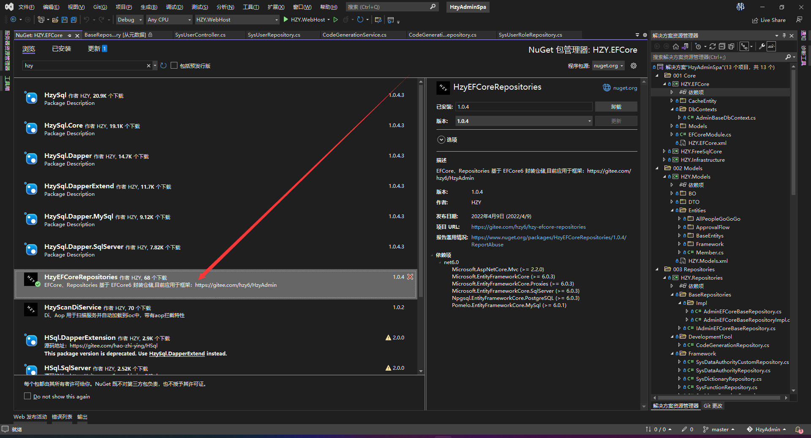

# HzyEFCoreRepositories

#### 介绍
基于 EFCore6 封装仓储

文档地址:https://gitee.com/hzy6/hzy-efcore-repositories/wikis/pages

### 功能
1、仓储具有基本的 CRUD
2、分表的情况支持动态表名查询
3、监控EFCore 连接、事务、Sql、Sql耗时等统计信息

#### 安装请使用 Nuget 搜索 HzyEFCoreRepositories

#### 目前应用于框架

使用请参考这里：https://gitee.com/hzy6/HzyAdmin

